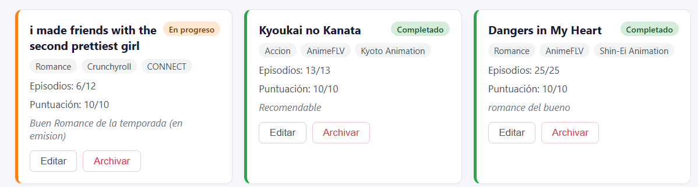

# Anime Tracker — Proyecto 2 Web

Aplicación fullstack para registrar y hacer seguimiento de anime y series. Desarrollada con React (Vite) en el frontend y Express + SQLite en el backend.

## Tecnologías

- **Frontend:** React, Vite, LocalStorage
- **Backend:** Node.js, Express, SQLite (node:sqlite)

## Estructura del proyecto

```
Proyecto2_Web/
├── frontend/      # React + Vite
└── backend/       # Express + SQLite
```

## Cómo correr el proyecto

### Frontend
```bash
cd frontend
npm install
npm run dev
```

### Backend
```bash
cd backend
npm install
npm run dev
```

## Mis primeros Items



| Nombre | Categoría | Estado | Puntuación |
|--------|-----------|--------|------------|
| Fullmetal Alchemist: Brotherhood | Aventura | Completado | 10 |
| Attack on Titan | Acción | Completado | 9 |
| Demon Slayer | Acción | En progreso | 8 |
